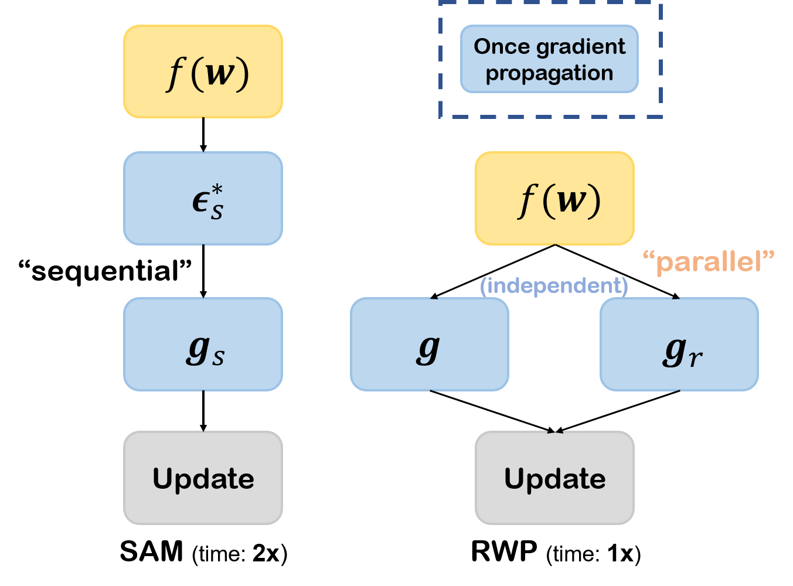

# Efficient Generalization Improvement Guided by Random Weight Perturbation

This repository contains a PyTorch implementation of the paper: **Efficient Generalization Improvement Guided by Random Weight Perturbation**.


## Abstract
To fully uncover the great potential of deep neural networks (DNNs), various learning algorithms have been developed to improve the model's generalization ability. Recently, sharpness-aware minimization (SAM) establishes a generic scheme for generalization improvements by minimizing the sharpness measure within a small neighborhood and achieves state-of-the-art performance. However, SAM requires two consecutive gradient evaluations for solving the min-max problem and inevitably doubles the training time. In this paper, we resort to filter-wise random weight perturbations (RWP) to decouple the nested gradients in SAM. Different from the small adversarial perturbations in SAM, RWP is softer and allows a much larger magnitude of perturbations. Specifically, we jointly optimize the loss function with random perturbations and the original loss function: the former guides the network towards a wider flat region while the latter helps recover the necessary local information. These two loss terms are complementary to each other and mutually independent. Hence, the corresponding gradients can be efficiently computed in parallel, enabling nearly the same training speed as regular training. As a result, we achieve very competitive performance on CIFAR and remarkably better performance on ImageNet (e.g. $+1.1\%$) compared with SAM, but always require half of the training time.

<div align="center">


<div align="left">

## Example Usage

We provide example usages in `/recipes/`. 
For parallelized training of RWP, we could run

```
bash recipes/run_rwp_ddp.sh
```
